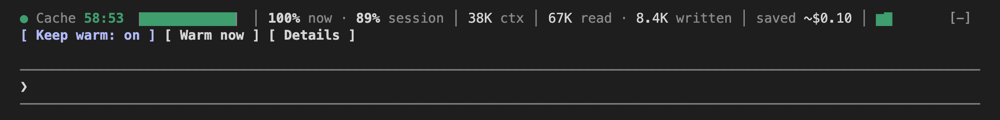

<div align="center">


# Cache Maxxer

**A Claude Code plugin that shows your prompt cache's countdown and hit rate, and can keep the cache warm so you stop paying to rebuild it.**

[**Install**](#get-started) · [Guide](docs/guide.md) · [Privacy](#privacy) · [Changelog](CHANGELOG.md) · [Report a bug](https://github.com/vayaan-labs/cache-maxxer/issues)

[](https://github.com/vayaan-labs/cache-maxxer/actions/workflows/ci.yml) [](https://github.com/vayaan-labs/cache-maxxer/releases/latest)  [](LICENSE) [](https://github.com/vayaan-labs/cache-maxxer/stargazers)


*The band in the Claude desktop app, right above the input box.*

</div>

Claude Code keeps a saved copy of your conversation, the prompt cache, so each new message doesn't pay full price to re-read everything before it. That copy quietly expires after five minutes or an hour without a message, and your next one pays to write the whole conversation again: slower, and on a long Opus session well over a dollar.

Cache Maxxer adds a thin band right above your input box with the time left on that cache and your hit rate, the share of each request read from the cache instead of paid for again. When the cache does get rebuilt, it tells you why. And if you want, it keeps the cache alive while you step away.

## Get started

1. **Add the Vayaan Labs catalogue.** In the Claude desktop app, open the Directory, choose Plugins, press + and choose Add marketplace, then Add from a repository, and enter `vayaan-labs/claude-plugins`. In a terminal:

   ```
   claude plugin marketplace add vayaan-labs/claude-plugins
   ```

2. **Install Cache Maxxer.** Find it in the Vayaan Labs catalogue and install it, or in a terminal:

   ```
   claude plugin install cache-maxxer@vayaan-labs
   ```

3. **Send a message.** The band shows up once your conversation has a cache, which is after your first reply. If Claude Code was already open, run `/reload-plugins` first.

Or paste this prompt to your agent:

```
Install the Cache Maxxer plugin for Claude Code
(https://github.com/vayaan-labs/cache-maxxer).
Run these two commands:
claude plugin marketplace add vayaan-labs/claude-plugins
claude plugin install cache-maxxer@vayaan-labs
Check that `claude plugin list` shows it enabled,
then tell me to run /reload-plugins.
```

Press **More** for the session's numbers, the last 10 requests with any rebuild marked, and the latest rebuild with its cost and cause. Press **Keep warm** to have it ping just before the cache expires. Everything else, from the settings to the `/cache-maxxer` command, is in the [guide](docs/guide.md).

## What you get

- **A countdown you can see.** Time left on the cache, a bar that drains, and a colour that turns amber, then red, as expiry gets close.
- **Your real cache hit rate.** The last request's and the whole session's, to two decimals and never rounded up, so 99.86% doesn't show as 100%.
- **Every rebuild explained.** One notice saying how much was re-written and why: you were away too long, you switched model, compacted or cleared, or Claude Code's setup changed (its system prompt, tools or MCP servers).
- **Keep warm.** One tiny request just before expiry resets the timer for a few cents. It stops after three hours without a message from you, or whatever limit you set.
- **What the cache is worth.** Tokens read from the cache and written to it, what the writes cost and what the reads saved, priced from Anthropic's own price table, which it checks once a day so a new model gets prices as soon as Anthropic lists it.
- **Terminal and desktop app.** A one-line band in the terminal. In the Claude desktop app, a drawn band with a large countdown, hit-rate rings and native menus, which matches your light or dark appearance and fits a narrow window.

<div align="center">



*The same band in a terminal, on one line.*


*Opened with More and keep warm on: what the cache cost this session, what it saved, and what the pings saved.*

</div>

## Supported

- Claude Code 2.1.289 or later, in the terminal and in the Claude desktop app, on macOS.
- Every current Claude model. Prices come from Anthropic's public price table; a model not in it gets token counts and no dollar figures.
- One-hour and five-minute caches, read from your session or set by you.

## Privacy

Cache Maxxer has no server, account or analytics. It makes one network request of its own: it reads Anthropic's public pricing page (`platform.claude.com/docs/en/about-claude/pricing.md`) at most once a day, sending nothing about you or your session. Set `live_prices` to `off` ([settings](docs/guide.md)) and it never does.

Two of its buttons send a request to Claude, the same place your messages already go, and each counts toward your usage like any other request. Keep warm and Warm now ask for a one-word reply over your conversation. Compact, which takes Warm now's place once the cache has expired, asks Claude Code to compact the conversation.

On your machine, while the cache length is set to `auto`, it reads the end of your session's transcript file to learn how long the cache lives, looking only at the cache-write token counts in it. It saves four things in the plugin's own data: the keep-warm toggle, whether the detail is open, whether the desktop band is tucked away, and the last price table. Everything else lives in memory for the session.

## Contributing

Found a bug? [Open an issue](https://github.com/vayaan-labs/cache-maxxer/issues). Before sending a change, run `claude plugin validate --strict .claude-plugin/plugin.json` and `claude plugin test`, and see the [guide](docs/guide.md#development) to try it without installing. To report a security problem privately, see [SECURITY.md](SECURITY.md).

## Licence

MIT. Built by [@YaanFPV](https://github.com/YaanFPV).
