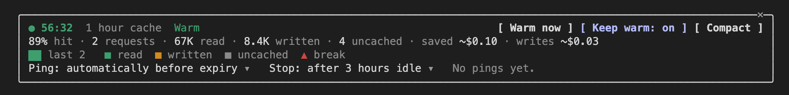

# Cache Maxxer

**See your Claude Code prompt cache, and stop it expiring on you.**

Claude Code keeps your conversation in a prompt cache, so each new message does not pay full price to re-read everything said before it. That cache runs out after an idle spell, and Claude Code never tells you. The next message then pays to write the whole conversation again, which costs more and answers slower. Cache Maxxer puts the cache's countdown and hit rate above your input box like a status line, tells you why whenever the cache breaks or expires, and can keep it warm to cut your Claude Code cost.


## Why the cache matters

While the cache is warm, each request reads your conversation at a small fraction of the normal input price. Once it expires, the next message writes the whole conversation back in. With the prices built into Cache Maxxer for Opus 5.5 ($4 per million tokens of plain input, $0.20 to read from the cache and $8 to write to an hour-long cache), a 180K token conversation costs about 4 cents to read and about $1.44 to write again after a lapse. How long the cache lives depends on how you sign in, either an hour or five minutes, and Cache Maxxer reads which one you have from your session.

## Know where your cache stands

A band appears above the input box as soon as your conversation has a cache. From left to right it shows a status dot, a countdown to expiry with a track that drains as time passes, the hit rate of the last request and of the whole session, the size of the context your next message sends, what the session has read from and written to the cache, what the cache has saved you in dollars, and a small chart of recent requests.

The countdown is green while the cache is warm, amber in the last sixth of its life, red in the last thirtieth, and grey once it has expired. When it has expired the band says what your next message will re-write and roughly what that costs. The saved figure appears once reads have paid back the cost of the writes, so it is missing for the first message or two of a session.

When there is less room, pieces drop out in a fixed order: the chart, savings, totals, the keep-warm note, the track, the context size, then the session hit rate. The countdown and the last request's hit rate always stay. Whatever other plugins draw in the same spot stays too, shown under the band. The Desktop app draws the same band as a row with clickable buttons.

The band comes with buttons: Keep warm (on or off), Warm now while the cache is warm, Compact once it has expired, and Details.

Dollar figures are known for Opus 5.5, Sonnet 5.5 and Haiku 4.5, matched by model id. For any other model Cache Maxxer shows tokens only and never guesses a price.

## See why a cache broke

Whenever the cache is rebuilt you get one notice, such as "Cache rebuilt · 182K tokens re-written · expired after 63m idle". The cause is one of: the cache expired while you were away, the model was switched, the conversation was compacted, `/clear` ran, or otherwise the system prompt, tools or MCP servers changed.

A cache break is a request that wrote more than 20K tokens and read less than half of what the request before it had cached, which means the cached start of the conversation was lost. A big new message sent on top of a cache that was read, such as a large file early in a session, is not a break. The first request of a fresh session has nothing to lose, so it is not counted as one.

With keep warm off, you also get one notice when the cache is about to run out: "Cache expires in 4m · Warm now to keep it".

## Keep it warm on purpose

Keep warm is off by default. When it is on, your session is idle and the cache is about to run out, Cache Maxxer sends one very short request over your conversation asking for a one-word reply. That request reads the cached context, which resets the cache's timer, and Cache Maxxer notes the ping and what it cost. It sends one at a time, never while Claude is working, and does not retry in a loop if one fails: it tells you why and leaves that expiry alone. Warm now does the same once, when you ask.

A ping costs about the size of your context times the cache-read price. For a 180K token Opus 5.5 conversation that is a few cents, against well over a dollar to re-write the same context after a lapse. With a five minute cache it pings every few minutes, so it adds up much faster than with an hour cache. If a ping finds the cache had already lapsed, it rebuilt the cache instead: the notice says so with what was written and what it cost, the cache is warm again, and the band's keep-warm note counts it as a rebuild rather than as a ping that kept the cache warm.

Keep warm stops once you have not sent anything for the idle cap (three hours unless you change it), and the band says so, so a session you walked away from does not keep spending. It starts again when you send your next message.

## The Details pane

Press Details, or run `/cache`, for the pane. It takes three to five lines, so it stays out of the way of your conversation.


The first line is the status: the countdown, how long your cache lives, and its state (Warm, Expiring soon, or Expired). The buttons sit on the same line: Warm now while the cache is live, the Keep warm toggle, and Compact. The second line holds the session's numbers: hit rate, requests, tokens read, written and uncached, and, for models with a known price, the dollars saved and spent on writes. On a narrow window the numbers drop from the end rather than wrapping. The third line is the history, one bar for each of the last requests with the newest on the right, and a legend for read, written, uncached and break.

When the cache has broken, one more line gives the latest break: when it happened, how much was re-written, roughly what that cost and why, with a count of earlier breaks. It is absent while there are none.

While Keep warm is on, the pane adds a last line with two pickers, how long before expiry to ping and when to stop after you have been idle, next to a count of the pings so far and what they cost. If keep warm has stopped because you were idle, it says so there.



In the Desktop app the pane has the same lines, with the status and the history drawn as small graphics and a Close button.

## Get started

1. **Add the Vayaan Labs catalogue.** In the Claude desktop app, open the Directory, choose Plugins, press the + button at the top right and choose Add marketplace, then Add from a repository ("Sync a plugin marketplace from a GitHub repository or Git URL"). Enter `vayaan-labs/claude-plugins`, or the full link `https://github.com/vayaan-labs/claude-plugins`.

   

   In a terminal, run `claude plugin marketplace add vayaan-labs/claude-plugins` instead.

2. **Install Cache Maxxer.** In the Desktop app, find Cache Maxxer in the Vayaan Labs catalogue and install it. In a terminal, run `claude plugin install cache-maxxer@vayaan-labs`.

3. **Send a message.** The band appears above the input box once your conversation has a cache, which is after your first reply. If Claude Code was already open when you installed, run `/reload-plugins` in that session first, or start a new one.

Tested with Claude Code 2.1.289 on macOS, in the terminal. The Desktop app route follows the app's own labels, but its band and pane have not been run by us yet.

## Commands

`/cache` opens the Details pane, or prints a one-line summary where nothing can be drawn (a `claude -p` run). `/cache warm` sends one ping. `/cache keep on` and `/cache keep off` set the keep-warm toggle, which is remembered as the default for new sessions. They run immediately, even while Claude is working. A ping never goes out during a turn, so `/cache warm` then tells you Claude is working and sends nothing.

## Settings

Cache Maxxer has three settings, each a choice from a short list. In a terminal, `claude plugin configure cache-maxxer@vayaan-labs` shows them. Or put them in your settings file, using the plugin's id:

```json
{
  "pluginConfigs": {
    "cache-maxxer@vayaan-labs": { "ttl": "1h", "lead": "auto", "idle_cap": "3h" }
  }
}
```

`ttl` is how long the cache lives: `auto` (the default) reads it from the newest cache write in your session transcript after each turn and assumes an hour, shown as "1h?", until it knows. `1h` and `5m` fix it.

`lead` is how long before expiry the notice and the ping come: `auto` is 4 minutes for an hour cache and 40 seconds for five minutes, or pick 1, 2, 4 or 8 minutes (never more than half the cache's life).

`idle_cap` is how long you can be idle before keep warm stops: 1h, 3h (the default), 8h or none.

## Privacy

Cache Maxxer makes no network requests of its own and has no server, account or analytics. The one thing that leaves your machine because of it is the keep-warm ping, and it goes where all your messages already go: Cache Maxxer asks Claude Code to send one very short request ("Reply with exactly one word: ok. Do not use any tools.") over your conversation. It sends one only when keep warm is on and the cache is about to expire, or when you press Warm now or run `/cache warm`. It counts toward your usage like any other request.

Everything else stays local, and this is all it runs or reads:

- To learn the cache length, it runs `find` to locate your session's transcript under your Claude config folder (`CLAUDE_CONFIG_DIR`, or `~/.claude`) and `tail` to read only the last 256 KB of it. It never reads the whole transcript, and it only does this when `ttl` is `auto`.
- When you press Compact, it asks Claude Code to compact the conversation.
- It remembers the keep-warm toggle in the plugin's own saved data. Everything else it tracks (the numbers behind the band and pane) lives in memory for the session.

## Updating and removing

Update with `claude plugin marketplace update vayaan-labs` and then `claude plugin update cache-maxxer@vayaan-labs`, and restart Claude Code to apply it. To remove the plugin, run `claude plugin uninstall cache-maxxer@vayaan-labs`. To remove the whole catalogue, run `claude plugin marketplace remove vayaan-labs`.

## Troubleshooting

**No band.** The band appears once your conversation has a cache, which is after the first reply, and only when the plugin is enabled (`claude plugin list` shows it). If Claude Code was open when you installed, run `/reload-plugins`. If it still does not appear, update Claude Code, since this plugin is tested on 2.1.289 only.

**The countdown shows "1h?".** Cache Maxxer has not yet seen how long your cache lives and is assuming an hour. It reads this from your session after each turn, or you can set `ttl` yourself.

**No dollar figures.** Prices are built in for Opus 5.5, Sonnet 5.5 and Haiku 4.5 only. With any other model you get token counts and no dollar amounts.

**`/cache` is missing.** Another plugin may have taken the name. The band and the buttons still work.

## Get help

Open an issue at https://github.com/vayaan-labs/cache-maxxer/issues. To report a security problem privately, see [SECURITY.md](SECURITY.md).

## Development

```
claude plugin validate --strict .claude-plugin/plugin.json
claude plugin test
```

To try a change without installing, run `claude --plugin-dir /path/to/cache-maxxer`. The type declarations Claude Code writes into `.claude-plugin/types/` are not committed.

MIT licensed. Built by @YaanFPV.
