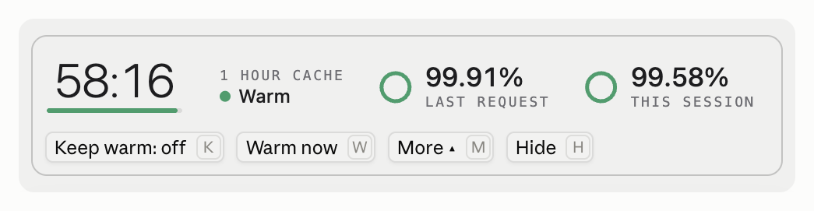
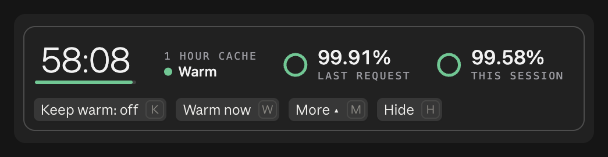
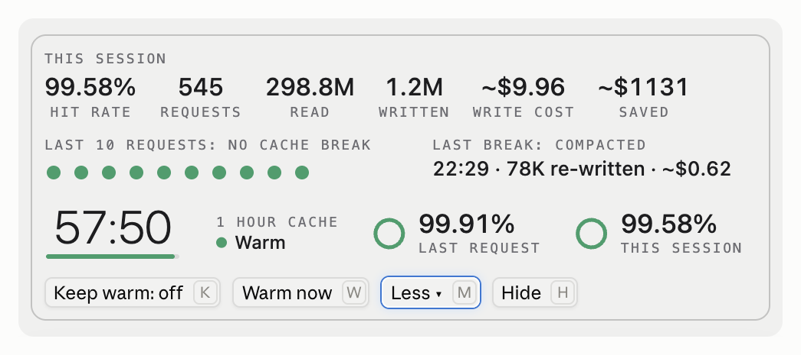
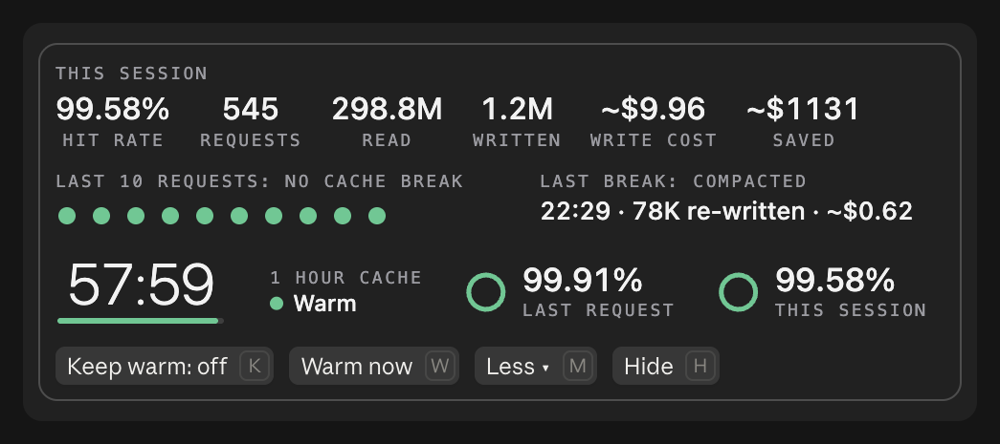
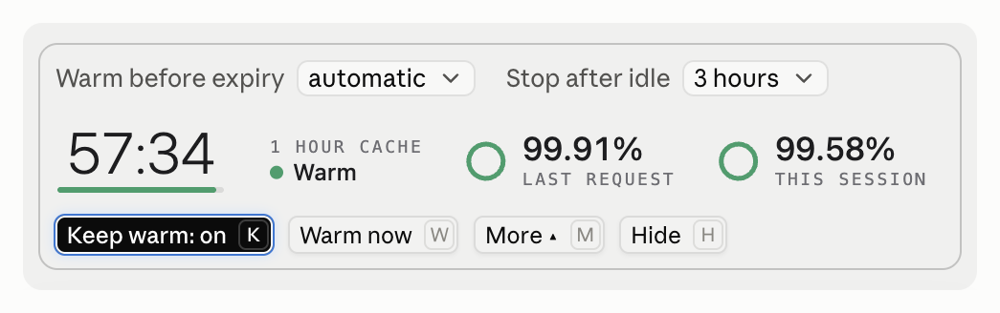
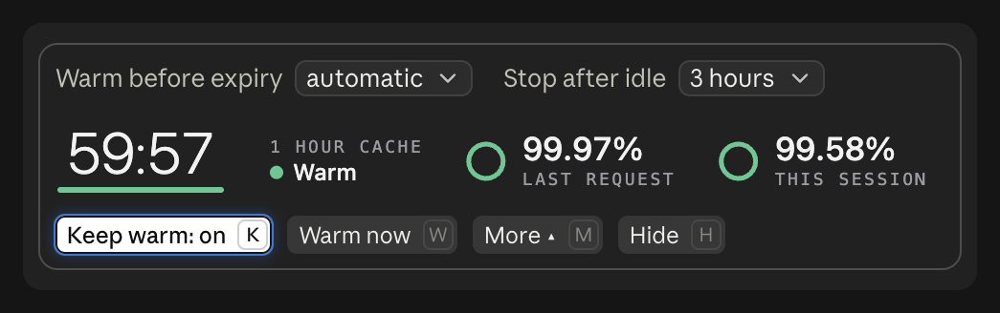
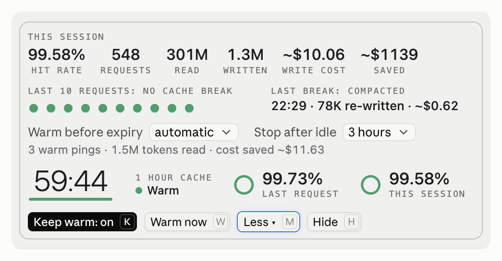
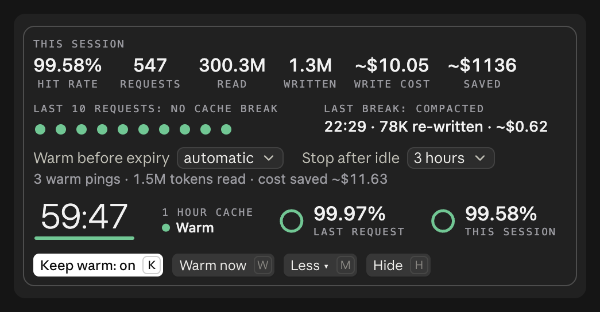
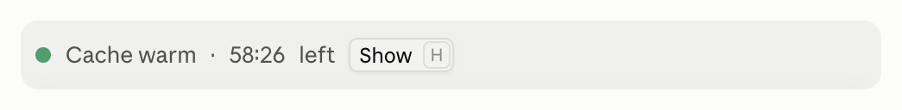
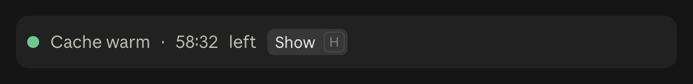

# Cache Maxxer guide

Everything the [README](../README.md) leaves out: how the cache works, what each part of the band means, keep warm in detail, the command, the settings and what to do when something looks wrong.

## Why the cache matters

While the cache is warm, each request reads your conversation at a small fraction of the normal input price. Once it expires, the next message writes the whole conversation back in. At Anthropic's prices for Opus 5.5 ($4 per million tokens of plain input, $0.20 to read from the cache and $8 to write to an hour-long cache), a 180K token conversation costs about 4 cents to read and about $1.44 to write again after a lapse.

A cache lives for either an hour or five minutes. Cache Maxxer uses your `ttl` setting if you set one, and otherwise reads the length from your session: the newest cache write in the session transcript, or the length Claude Code reports when you switch model. Until it has seen one it assumes an hour and says "1 hour cache, assumed".

## The band

The band sits in a thin frame above the input box and is one line: a status dot, a countdown with a bar that drains, how long your cache lives, and two hit rates, the last request's and the whole session's, such as "hit 99.86% last request · 94.01% this session". A rate is cut, never rounded up, so one short of 100% never reads 100.00%. Beside it are Keep warm, Warm now (Compact once the cache has expired) and More.

The countdown is green while the cache is warm, amber in the last sixth of its life and red in the last thirtieth, where the band also says "expiring soon", and grey once it has expired. Once it has expired the band says what your next message will re-write and roughly what that costs. The colors are your Claude Code theme's own.

Press More, or run `/cache-maxxer`, and the band opens upward, keeping its first line at the bottom next to the input box:

- **This session**: the hit rate, the number of requests, the tokens read from the cache and written to it, and, for models with a known price, the write cost and the dollars saved. The saved figure goes negative early in a session, while the writes have not yet been paid back by reads.
- **Last 10 requests**: a dot for each, newest on the right, with a red ▲ on any that broke the cache, and "no cache break" or how many there were.
- **Last break**: when the cache last broke, how much was re-written, roughly what that cost and why, and how many breaks came before it. It is absent while there are none.

Press Less to close it. Whether the detail is open is remembered for new sessions.

The band reflows to the room it has instead of cutting anything off. In a narrower terminal the rates read "request 99.86% · session 94.01%" and the cache length "1h cache"; where the status and the buttons cannot share a line the buttons move to their own, and in a very narrow terminal each label moves above its values. Whatever other plugins draw in the same spot stays, under the band. While the band has the keyboard (click it, or press ctrl+x tab), K toggles keep warm, W warms now, C compacts and M opens or closes the detail.

In the Claude desktop app the band is drawn for a window: the countdown as a large numeral over a bar that drains, each hit rate with a ring, the session's numbers as tiles, the last 10 requests as a row of marks, and the keep-warm choices as the app's own menus. It follows the system's light or dark appearance and frames itself like the input box. In a window too narrow for it, its drawn rows shrink together, text and marks alike, rather than wrapping; the buttons and menus keep their size and wrap. A ping takes a few seconds to come back over a long conversation, so Warm now reads Warming… until it does. The app shows a plugin's notices at its window's corner, away from this session in a split, so here every Cache Maxxer notice, such as what a ping did or that the cache was rebuilt, appears in the band for a few seconds instead. Hide (or H) tucks it away to a small chip with the countdown and a Show button; it stays tucked away for new sessions until you press Show or run `/cache-maxxer`.

| | Light | Dark |
|---|---|---|
| Closed |  |  |
| More |  |  |
| Keep warm on |  |  |
| Keep warm, More |  |  |
| Hidden |  |  |

## Prices

Dollar figures use the price table Anthropic publishes, matched by model id. Cache Maxxer reads it when Claude Code starts, at most once a day, so a new model or a price change shows up without an update; until that read has worked it uses the copy of the same table it ships with, which covers every current Claude model. A model priced by prompt length, such as Haiku 5.5, is priced at the rate for each request's own size. For a model in neither table Cache Maxxer shows tokens only and never guesses a price.

## Cache breaks

Whenever the cache is rebuilt you get one notice, such as "Cache rebuilt · 182K tokens re-written · expired after 63m idle". The cause is one of: the cache expired while you were away, the model was switched, the conversation was compacted, `/clear` ran, or otherwise the system prompt, tools or MCP servers changed.

A break is a request that wrote more than 20K tokens and read less than half of what the request before it had cached, which means the cached start of the conversation was lost. A big new message sent on top of a cache that was read, such as a large file early in a session, is not a break. The first request of a fresh session has nothing to lose, so it is not counted as one.

With keep warm off you also get one notice when the cache is about to run out: "Cache expires in 4m · Warm now to keep it".

## Keep warm

Keep warm is off by default. When it is on, your session is idle and the cache is about to run out, Cache Maxxer sends one very short request over your conversation asking for a one-word reply. That request reads the cached context, which resets the cache's timer. It sends one at a time, never while Claude is working, and does not retry in a loop if one fails: it tells you why and leaves that expiry alone. Warm now does the same once, when you ask. Either way you get a notice such as "Cache warmed · 180K tokens read · cost saved ~$1.40": what the ping read, and what that saved over re-writing it, those tokens at the cache-write price less the cache-read price.

A ping costs about the size of your context times the cache-read price. For a 180K token Opus 5.5 conversation that is a few cents, against well over a dollar to re-write the same context after a lapse. With a five-minute cache it pings every few minutes, so it adds up much faster than with an hour cache. If a ping finds the cache had already lapsed, it rebuilt the cache instead: the notice says so with what was written and what it cost, and the keep-warm row counts it as a rebuild.

Keep warm stops once you have not sent anything for the idle cap (three hours unless you change it), and the band says so, so a session you walked away from does not keep spending. It starts again with your next message.

While keep warm is on, the band shows its own row above the first line with two choices as buttons: how long before expiry to ping, and when to stop after you have been idle, such as "Warm before expiry: automatic ▴". Click one and its options open directly above it, one per line, the current one highlighted; pick one, or click the choice again to close the list unchanged. Where room is short the choices use shorter names, such as "Warm: automatic ▴". Once you press More the row also shows the warm pings so far, the tokens they read and what they saved: those tokens at the cache-write price less the cache-read price they paid instead.

## The command

`/cache-maxxer` opens the band's detail (and shows the band before your first message, to say there is no cache yet), or prints a one-line summary where nothing can be drawn, such as a `claude -p` run.

- `/cache-maxxer more` opens the detail and `/cache-maxxer less` closes it.
- `/cache-maxxer hide` and `/cache-maxxer show` tuck the desktop app's band away to its chip and bring it back. `/cache-maxxer` on its own brings it back too, with the detail open.
- `/cache-maxxer warm` sends one ping.
- `/cache-maxxer keep on` and `/cache-maxxer keep off` set keep warm, which is remembered for new sessions.

They run straight away, even while Claude is working. A ping never goes out during a turn, which reads the cache itself, so `/cache-maxxer warm` then says Claude is working and sends nothing.

## Settings

Cache Maxxer has four settings, each a choice from a short list. In a terminal, `claude plugin configure cache-maxxer@vayaan-labs` shows them. Or put them in your settings file under the plugin's id:

```json
{
  "pluginConfigs": {
    "cache-maxxer@vayaan-labs": { "ttl": "1h", "lead": "auto", "idle_cap": "3h", "live_prices": "on" }
  }
}
```

| Setting | Choices | What it does |
| --- | --- | --- |
| `ttl` | `auto` (default), `1h`, `5m` | How long the cache lives. `auto` reads it from the newest cache write in your session transcript, looking every 15 seconds until it has seen one and then after a turn at most every 10 minutes, or from the length Claude Code reports when you switch model. |
| `lead` | `auto` (default), `1m`, `2m`, `4m`, `8m` | How long before expiry the notice and the ping come. `auto` is 4 minutes for an hour cache and 40 seconds for five minutes, and a choice is never more than half the cache's life. |
| `idle_cap` | `1h`, `3h` (default), `8h`, `none` | How long you can be idle before keep warm stops. |
| `live_prices` | `on` (default), `off` | Whether Cache Maxxer reads Anthropic's price table once a day. Off keeps the prices it shipped with. |

## What it runs on your machine

To learn the cache length, while `ttl` is `auto`, it runs `find` to locate your session's transcript under your Claude config folder (`CLAUDE_CONFIG_DIR`, or `~/.claude`) and `tail` to read at most the last 256 KiB of it. It looks only at the cache-write token counts in what it reads. The keep-warm ping is "Reply with exactly one word: ok. Do not use any tools." sent over your conversation through Claude Code.

## Updating and removing

```
claude plugin marketplace update vayaan-labs
claude plugin update cache-maxxer@vayaan-labs
```

Then restart Claude Code. To remove it, run `claude plugin uninstall cache-maxxer@vayaan-labs`, and to remove the whole catalogue, `claude plugin marketplace remove vayaan-labs`.

## Troubleshooting

**No band.** It appears once your conversation has a cache, which is after the first reply, and only while the plugin is enabled (`claude plugin list` shows it). If Claude Code was open when you installed, run `/reload-plugins`. If it still does not appear, update Claude Code to 2.1.289 or later.

**No band in a split view.** The desktop app draws a plugin's band only in the leftmost chat of a split, so a chat in another pane shows none. Move the chat to the left, or open it in its own window, and the band is there. Anthropic tracks it as [anthropics/claude-code#99265](https://github.com/anthropics/claude-code/issues/99265).

**The band says "assumed".** Cache Maxxer has not yet seen how long your cache lives and is assuming an hour. It keeps looking every 15 seconds, or you can set `ttl` yourself.

**No dollar figures.** The model is in neither Anthropic's price table nor the copy Cache Maxxer ships with, which happens for a model released after your copy and before the daily read has worked, or with `live_prices` off. You get token counts until a read of the page lists it.

**`/cache-maxxer` is missing.** Another plugin may have taken the name. The band and its buttons still work.

## Development

```
claude plugin validate --strict .claude-plugin/plugin.json
claude plugin test
```

To try a change without installing, run `claude --plugin-dir /path/to/cache-maxxer`. The type declarations Claude Code writes into `.claude-plugin/types/` are not committed.
